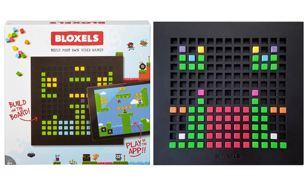

Bij CoderDojo kunnen kinderen van 7 t/m 17 jaar leren programmeren. Dit wordt helemaal gratis verzorgd door vrijwilligers!

# CoderDojo Gorinchem

Bij CoderDojo kun je verschillende activiteiten doen. Aan sommige projecten kun je ook thuis werken.
Hier lees je welke activiteiten we doen en zie je hoe je er thuis mee aan de slag kunt gaan.
Meer informatie over CoderDojo Gorinchem en een formulier om je op te geven staat op de website van [Bibliotheek AanZet](https://www.debibliotheekaanzet.nl/activiteiten/coderdojo). Op de website van [Coder(dojo) Nederland](https://coderdojo.nl) lees je wat CoderDojo inhoudt, waarom het bestaat en hoe je vrijwilliger kunt worden.

## Wat heb je nodig?

- een gezonde dosis nieuwsgierigheid!
- je bent tussen de 7 en 17 jaar
- het is gratis, wel even aanmelden, zodat we weten dat je erbij bent: [Bibliotheek AanZet](https://www.debibliotheekaanzet.nl/activiteiten/coderdojo)
- als je je eigen laptop meeneemt kun je bewaren wat je hebt gemaakt, er de volgende keer of thuis aan verder werken
- als je een eigen Arduino starter kit meeneemt (en een doosje om je prototype veilig in te bewaren) kun je er thuis aan verder werken; we hebben ook een aantal Arduino kits te leen voor gebruik tijdens CoderDojo

## Leren programmeren met Codecademy

Leer hier hoe je een basis kennis voor progameren kan opbouwen. Dit gaan we doen met behulp van de website Codecademy. Ideaal om ook thuis te proberen. Lees er meer over op de [pagina over codecademy](codecademy.md)

## Programmeren met HTML, CSS en JavaScript

### Maak je eigen website

Leer hoe je met behulp van de opmaaktalen HTML en CSS een mooite website kunt maken. Ook geschikt om thuis aan te werken!

### Vang Octo

Leer hoe je met behulp van HTML, CSS en JavaScript een spel kunt maken voor in de browser. Een voorbeeld van het spel kun je [hier](https://coderdojo-gorinchem.github.io/vang-octo/) vinden en de bron code van het uiteindelijke spel [hier](https://github.com/coderdojo-gorinchem/vang-octo/).

## Programmeren met Python

Leer hoe je met behulp van de Python programmeertaal en de module PyGameZero een programma of spel maakt. Je hebt hier een laptop of computer met Windows of MacOS voor nodig. Daar installeer je een paar gratis programma's op. Lees er meer over op de [pagina over Python](python.md).
Ook geschikt om thuis aan te werken!

## Maak je eigen spel met Bloxels

Wil je een spel maken zonder programmeren? Je kunt hiervoor Bloxels gebruiken. Met de gekleurde blokjes "teken" je je spelwereld, hoofdpersoon, en items, en via de tablets voeg je je kunstwerken toe aan de Bloxels app. In de bibliotheek hebben we een aantal tablets met een betaalde Bloxels licentie, waarop je kunt werken. Wil je er thuis ook mee werken, dan moet je je eigen licentie kopen (dat kost 3,99 euro voor één maand of 20 euro voor een jaar).

## Electronica en 3D teken software

Je kunt leren hoe "stroom" werkt, hoe electriciteit een lamp laat branden, hoe een schakelaar werkt.

## Bouw je eigen apparaatje met een Arduino of Microbit

Als jouw apparaatje een beweging waarneemt, zet het een lamp aan. Handig als je 's nachts uit bed wilt maar het is donker.

## Soldeer je eigen kunstwerk met LED lampjes

Af en toe solderen we met LED lampjes een kunstwerk; deze activiteit is er niet elke keer. Hou de website goed in de gaten!

## Robots programmeren

Laat een robot (ozobot) opdrachten uitvoeren.

## Vrijwilligers

CoderDojo Gorinchem wordt gerund door vrijwilligers en wordt gesponsord door Bibliotheek AanZet, Gorinchem.

| Naam    | Rol                                                                                                                               |
| ------- | --------------------------------------------------------------------------------------------------------------------------------- |
| Joke    | Champion: de oprichter en organisator van een Dojo                                                                                |
| Ahmad   | Mentor                                                                                                                            |
| Elise   | Mentor, _Studente HBO ICT, Ervaring met lesgeven en Coaching. Ook een passie voor het onderwijs en pyschologie._                  |
| Henk    | Mentor                                                                                                                            |
| Joris   | Mentor, _Technisch Team Lead werkend aan wetenschappelijke software. Geinteresseerd in proces automatisering en web-technologie._ |
| Leandro | Mentor                                                                                                                            |
| Marcel  | Mentor                                                                                                                            |

## Contact

Wil je iets vragen? Stuur een e-mail naar [jjordens@debibliotheekaanzet.nl](mailto:jjordens@debibliotheekaanzet.nl) of bel tijdens openingstijden naar de Bibliotheek: 088-242 5074.
Op de website van [Bibliotheek AanZet](https://www.debibliotheekaanzet.nl/activiteiten/coderdojo) zie je wanneer de volgende CoderDojo plaatsvindt en kun je je aanmelden.
Het adres van de bibliotheek is: Groenmarkt 1, 4201 EE Gorinchem.
