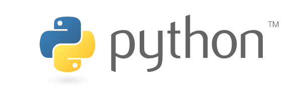
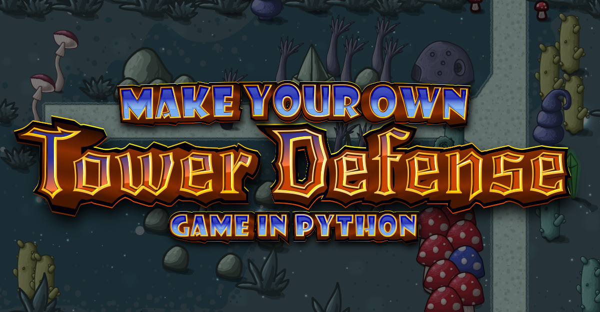

# Programmeren met Python

## Wat ga je leren?
Je leert de programmeertaal Python gebruiken om een programma of spel te schrijven.

## Wat heb je nodig?
Om Python te kunnen gebruiken op een computer moet je een paar gratis programma's installeren:

- versie 3 van de [Python programmeertaal](https://www.python.org/downloads/)
  - het commando `python` moet vanaf een commandline kunnen worden uitgevoerd; soms doet het installatieprogramma dit voor je, en soms moet je dat zelf nog instellen. Probeer het even uit, door het programma `Command` (Windows) of `Terminal` (MacOS) te openen en te controleren of het commando `python --version` werkt (op sommige computers heet het commando `python3 --version`).  In [dit Engelstalige filmpje op youtube](https://www.youtube.com/watch?v=LI0bpqpERlM) doet iemand het voor.
- een tekst editor om code te schrijven (bijvoorbeeld [Visual Studio Code](https://code.visualstudio.com) van Microsoft, of [Notepad++](https://notepad-plus-plus.org/downloads/))
  - handig: installeer ook de [Python plugin](https://marketplace.visualstudio.com/items?itemName=ms-python.python) in Visual Studio Code
- de Python module [PyGameZero](https://pygame-zero.readthedocs.io/) om eenvoudig spelletjes te kunnen maken

## Waar kun je meer informatie vinden?
- op de website [coder(dojo).nl](https://coderdojo.nl/online-les/python/basis-programmeren) staat een video van een uur waarin de basis van Python wordt uitgelegd door de voorzitter van CoderDojo Nederland.
- op de Engelstalige website [w3schools](https://www.w3schools.com/python/) staat een tutorial over Python, waarin de meestgebruikte commando's worden uitgelegd en waar je (via de groene knop "Try it yourself") de commando's kunt uitproberen en onderzoeken.
- op de Engelstalige website [trinket.io](https://hourofpython.trinket.io/a-visual-introduction-to-python#/welcome/an-hour-of-code) kun je stap voor stap een cursus volgen, zonder dat je Python hoeft te installeren op je eigen laptop of computer.

- een compleet stappenplan (in het Engels, en voor gevorderde programmeurs) om een Tower Defense spel te maken met Python, [vind je hier](https://www.inspiredpython.com/course/create-tower-defense-game/make-your-own-tower-defense-game-with-pygame#introduction-course-plan)

