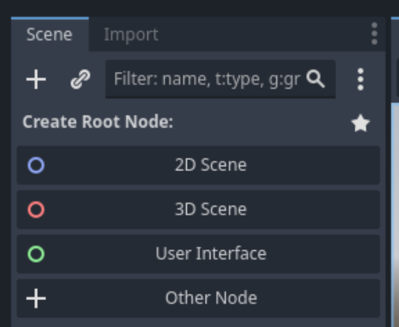
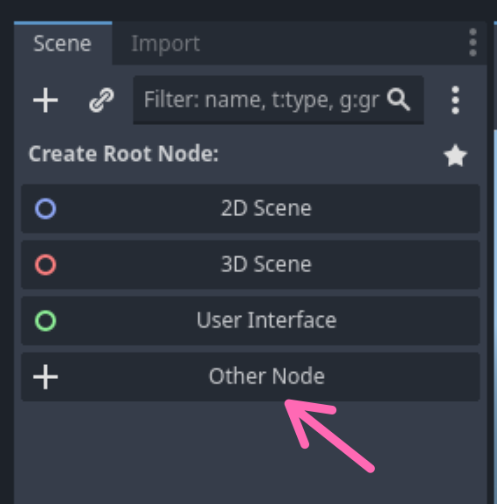
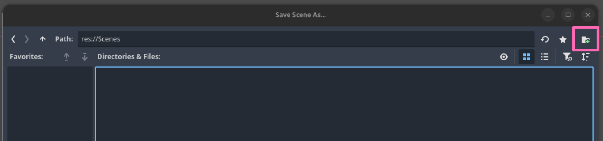
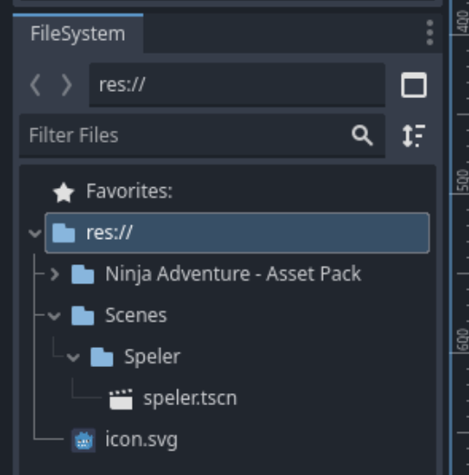
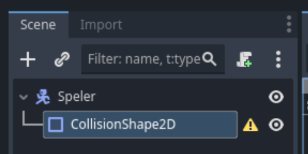
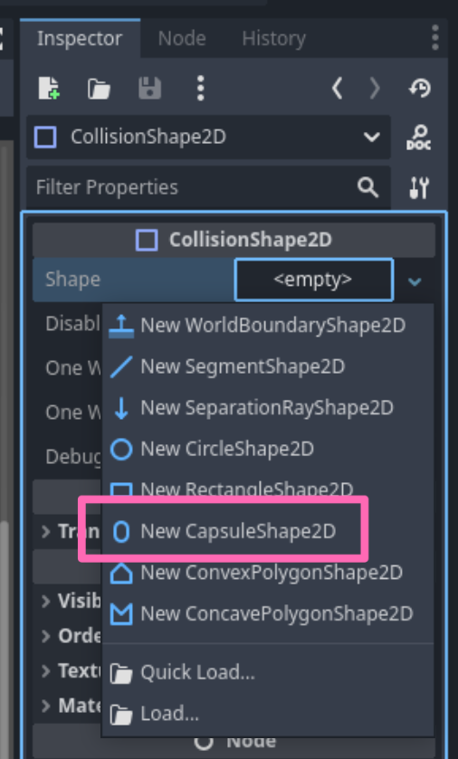
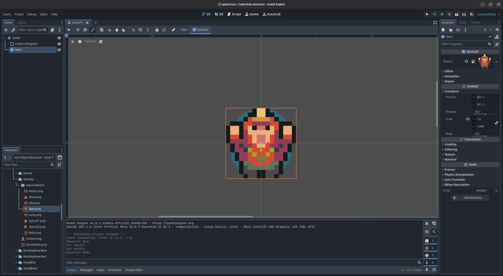

---
categories:
  - Activiteiten
order: -1
tags:
  - 2D
  - Godot
  - Spel
---

# De Speler

Misschien wel het allerbelangrijkste aan ieder spel is het karakter van de speler. Dit is dan ook het eerste aspect van het spel waar we aan gaan werken. Voordat we gaan beginnen, maken we nogmaals een kleine tussenstop voor een korte uitleg.

## _Scenes_ en _Nodes_

Linksbovenin in de interface van Godot zien we de "scene tree".

De "scene tree" geeft een overzicht van de verschillende "nodes" in de actieve "scene". Maar wat _zijn_ scenes en nodes?

- Nodes zijn de basisbouwblokken in Godot. Nodes worden gebruikt om eigenschappen van "dingen" in de spelwereld te beschrijven. Bijvoorbeeld:
  - Hoe de speler er uit ziet.
  - Wat voor geluid de speler maakt tijdens het lopen.
  - Welke karakters en monsters er rond lopen in een gebied.
  - Welke achtergrond muziek er speelt, etc.
- Scenes zijn groepen van nodes. Deze groepen kunnen eventueel worden hergebruikt. Bijvoorbeeld:
  - De speler
  - Een vijand
  - Een level

!!!
Dit klinkt waarschijnlijk op dit moment nog een beetje abstract, maar zodra we scenes en nodes gaan bouwen en gebruiken wordt alles snel duidelijk!
!!!

Aangezien we een 2D spel aan het maken zijn, zullen we vooral gebruik maken van 2D "nodes".

## Het uiterlijk van de speler

Zoals eerder genoemd kan de speler worden beschreven met behulp van een "scene" welke alle eigenschappen van de speler beschrijft, bijvoorbeeld hoe de speler er uit ziet, welke vorm de speler heeft (zodat er "gebotst" kan worden met andere objecten in de spelwereld), etc.

Elke scene heeft een "root" node waar alle andere eigenschappen aan "bevestigd" worden. Godot heeft heel veel verschillende "nodes" voor verschillende eigenschappen, maar degene die het beste past bij een speler is de _CharacterBody2D_. Dit "node type" heeft een aantal ingebouwde eigenschappen die het makkelijker maken om gedrag voor de speler te beschrijven.

Om onze "speler scene" te maken voeren we de volgende stappen uit:

- Klik op _Other Node_,

  

- Zoek naar _CharacterBody2D_ in het _Create New Node_ scherm dat verschijnt,
- Klik op _Create_.
- Het hoofdscherm van Godot zal van de 3D view naar de 2D view veranderen.
- Klik met de rechter muisknop op _CharacterBody2D_ en selecter _Rename_,
- Verander de naam naar _Speler_.

!!! De "scene" opslaan
Om ervoor te zorgen dat we geen werk verliezen is het zaak om ons werk vaak op te slaan.

We zullen ons project organiseren met behulp van een map per "scene" en deze mappen bij elkaar te plaatsen in een "scenes" map.
!!!

- Sla de scene op door op <kbd>Control</kbd>/<kbd>Cmd</kbd> + <kbd>s</kbd> te drukken of door op het menu _Scene_ en vervolgens op _Save Scene_ te klikken.
- Maak een map _Scene_ door op het knopje rechts bovenin te klikken

  

- Maak een map _Speler_.
- Klik op _Save_.

Als alles is goed gegaan zijn in het _Filesystem_ scherm links onderin de mappen _Scenes_ en _Speler_ met daarin een bestand _speler.tscn_ zichtbaar.

Godot waarschuwt ons, door middel van een waarschuwingsbord in de "scene tree", dat onze speler een of meerdere eigenschappen mist. De eerste waarschuwing is dat de speler geen vorm heeft en dus niet kan botsen, "collide" in het Engels, met andere karakters, de omgeving, etc. Om dit te verhelpen kunnen we een "collision shape" toevoegen aan de speler.

Klik op de _Speler_ node in de "scene tree" met de rechter muisknop en selecteer _Add Child Node&hellip;_. Het _Create New Node_ scherm verschijnt weer. Deze keer zoeken we naar _CollisionShape2D_ en klikken op _Create_. Het waarschuwingsbord verplaatst zich nu naar deze nieuwe "node".

Met de _CollisionShape2D_ geselecteerd aan de linkerkant van het scherm, kunnen we aan de rechterkant in de _Inspector_ een "vorm" (of "shape" in het Engels) toekennen. Voor de speler kiezen we voor de _CapsuleShape2D_.

Nadat we de nieuwe vorm/shape gekozen hebben verschijnt deze in het midden van ons scherm. De groene capsule geeft de "vorm" van onze speler aan. Deze "vorm" kunnen we aanpassen met behulp van de rode cirkels. Maar de speler heeft nog geen uiterlijk en dus is het moeilijk om de juiste vorm te kiezen. Het kiezen van het uiterlijk van de speler wordt de volgende stap.

Indien je nog niet eerder door het _Ninja Adventure - Asset Pack_ hebt gekeken, is dit _het_ moment om een uiterlijk voor de speler te zoeken. Ga naar de _Actors_ / _Characters_ map en bekijk de verschillende opties. De _SpriteSheet.png_ bestanden bevatten alle plaatjes voor de animaties van de verschillende karakters.

!!!
Op den duur zullen we de meeste animaties gebruiken voor het gekozen karakter. Om de stappen eenvoudig te houden, kiezen we voor dit moment één "sprite" uit de _SeparateAnim_ map.
!!!

Wanneer je je favoriete uiterlijk gevonden hebt, kies je een plaatje uit de _SeparateAnim_ map, bijvoorbeeld _Item_, en sleep je deze naar het midden van het scherm. Het uiterlijk en de "collision shape" moeten in het midden uitgelijnd zijn.

!!!
De "sprite" ziet er waarschijnlijk wat wazig uit. Voor het type spel wat we maken willen we dit niet. Om de sprite "scherp" te maken klik je op _Project_, _Project Settings_ en dan _Textures_ onder _Rendering_. Zet vervolgens _Default Texture Filter_ op _Nearest_ en klik op _Close_. De sprite is nu scherp.
!!!

Nu we een uiterlijk voor onze speler gekozen hebben, kunnen we de "collision shape" de juiste vorm geven door de rode cirkels te verslepen zodat we "collission shape" ongeveer achter de "sprite" verdwijnt.

!!!
De stappen in dit proces zijn nagenoeg hetzelfde voor alle karakters, monsters, etc. die we zullen toevoegen aan het spel:

- Maak een nieuwe scene
- Kies de juiste "root" node
- Voeg een botsings/collisions vorm/shape toe.
- Kies het uiterlijk van het karaketer.
!!!
