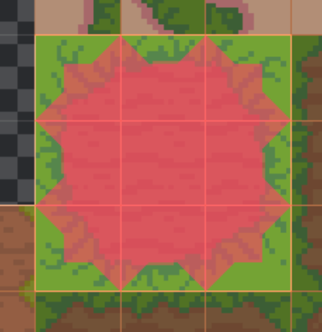
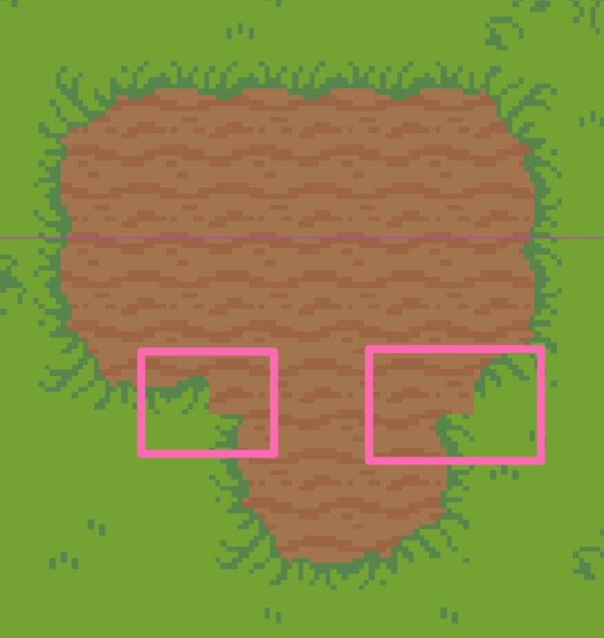
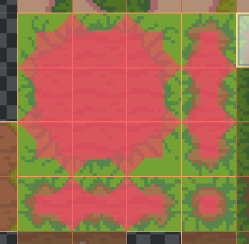
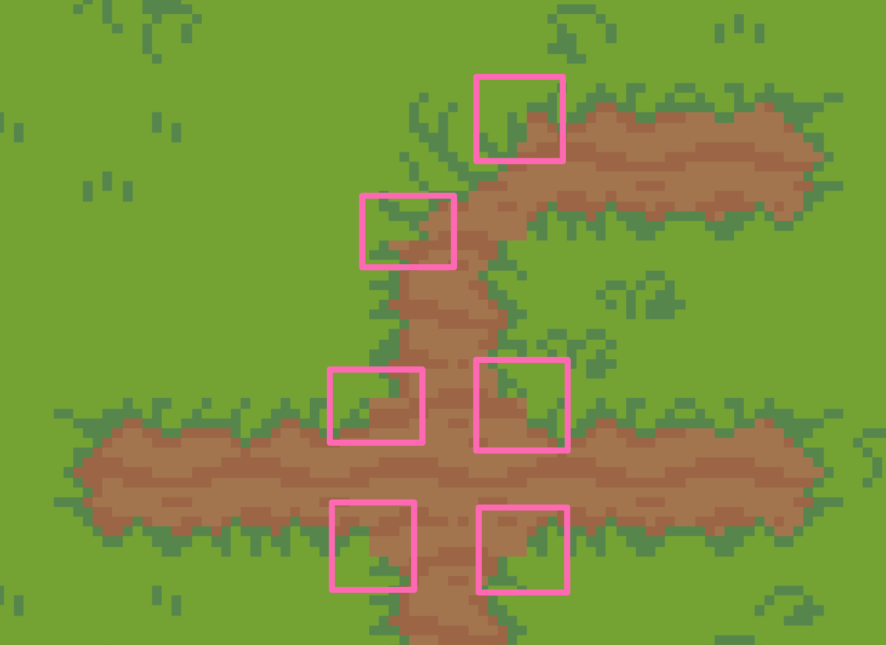
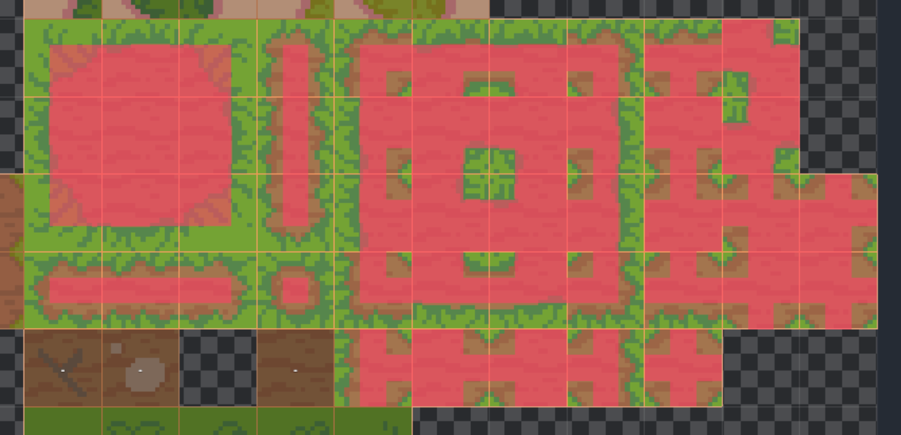
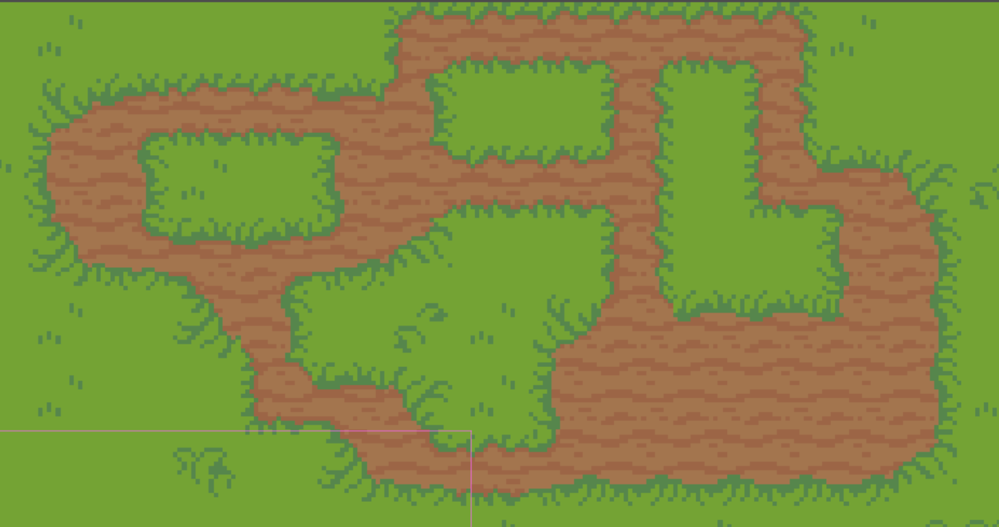
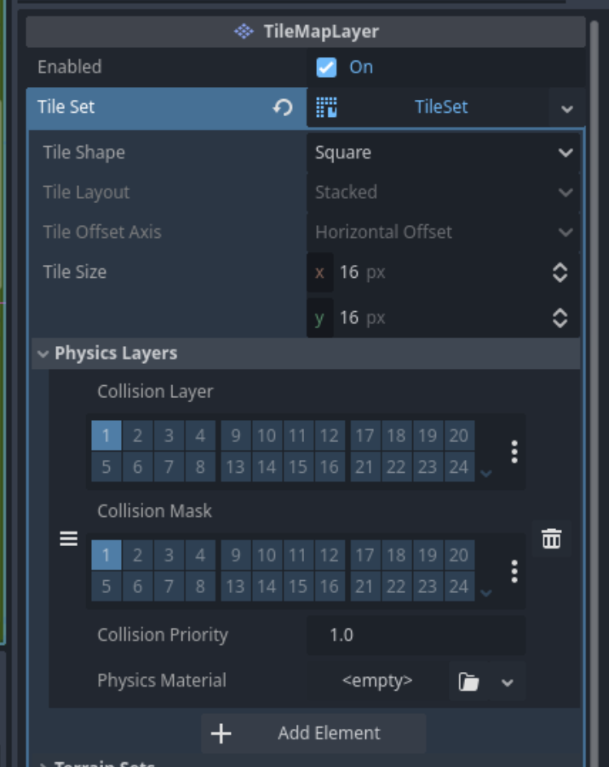
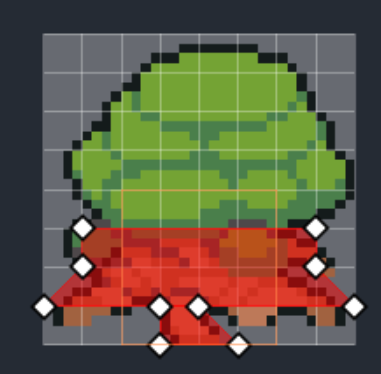

---
categories:
  - Activiteiten
order: -1
tags:
  - 2D
  - Godot
  - Spel
---

# De Wereld

Nu we een speler hebben die door een grijze "void" kan bewegen is het tijd om de wereld wat meer kleur te geven. Hiervoor gaan we gebruik maken van "tegels" waarmee we de wereld kunnen tekenen. Het "asset pack" wat we hebben gedownload heeft een aantal "tilesets" (verzamelingen van dit soort "tegels" voor verschillende typen gebieden) die we kunnen gebruiken. Deze kun je vinden in de _Backgrounds/Tilesets_ map.

In eerste instantie zullen we ons vooral bezig houden met het tekenen van de grond "buiten" in de bovenwereld. Hiervoor gaan we de _TilesetFloor_ tileset gebruiken. Deze tileset geeft ons acht verschillende soorten "grond" waar we de wereld vorm mee kunnen geven.

!!!
Als je eerdere lessen niet gevolgd hebt, kun je hier het spel downloaden in de staat waar we beginnen met deze les.

[!file Beginpunt voor deze les](/files/coderdojo-avontuur-resultaat-20250913.zip)
!!!

!!!
Om eenvoudiger de bestanden in het asset pack te kunnen bekijken, kun je deze het beste openen in de "verkenner". Om deze te openen, klik je met de rechter muisknop in het _FileSystem_ gebied en kies je voor _Open in File Manager_.
!!!

## Gras

- Open de "boven wereld".
- Maak een nieuwe node en kies de _TileMapLayer_.
- Verander de naam van de _TileMapLayer_ naar _Gras_.
- Klik in de _Inspector_ op _<empty>_ naast _Tile Set_.
- Kies voor _TileSet_ onder _New_.
- Klik op _TileSet_ om de eigenschappen te openen.
- Zorg er voor dat onder _Tile Size_ beide waardes op 16px staan.
- Klik onderaan in het midden van het scherm op _TileSet_.
- Zoek het _Backgrounds/Tilesets/TilesetFloor.png_ bestand in het _FileSystem_ gebied.
- Sleep het _TilesetFloor_ bestand naar het lege vlak onder _Tile Sources_.
- Er wordt gevraagd of de fileset automatisch in tiles moet worden opgesplitst. Antwoord hierop _Yes_.

We kunnen nu beginnen met tekenenen

- Kies onderin het scherm voor _TileMap_
- Zorg ervoor dat het potlood geselecteerd is in de menubalk boven de weergave van de tilemap (en dat de muisaanwijzer geselecteeerd is in de bovenste menubalk)
- Kies een "tegel" in de tilemap en begin te tekenen door de linker muisknop in te drukken en de muis over de weergave van de wereld te bewegen.
- Je kunt "tegels" weer verwijderen door er met de rechter muisknop op de klikken.

!!!
Experimenteer wat met tekenen, maar stop er niet te veel werk in. Aangezien dit
niet de meest efficiënte manier van het tekenen van terrein is zullen we de
experimenten meteen weer ongedaan maken en een aantal makkelijkere manieren
introduceren om terrein te tekenen.
!!!

Je zult misschien zien dat je over de speler heen kunt tekenen. Dat is natuurlijk niet de bedoeling. Gelukkig is dit eenvoudig op te lossen.

- In de "scene tree" staat de _Speler_ in dit geval "boven" de _Gras_ node.
- Sleep de _Gras_ node omhoog naar boven de _Speler_.
- De speler is nu weer zichtbaar.

We zullen nu wat meer gras tekenen waarbij we de editor automatisch willekeurig stukjes gras laten kiezen.

- Selecteer de grastegels die je wilt plaatsen door deze te selecteren, bijvoorbeeld door de linker muisknop ingedrukt te houden en over de verschillende tegels heen te bewegen, of door _shift_ ingedrukt te houden en de tegels die je wilt aan te klikken.
- Klik op de dobbelsteen in de menubalk boven de _TileMap_.
- Door de linker muisknop ingedrukt te houden in de weergave van de wereld en de muis rond te bewegen kun je nu willekeurig gras tekenen.
- In de menubalk staan ook een _lijn_ en _rechthoek_ tool om sneller grotere vlakken te tekenen.
- Je kunt ook de randen van een gebied tekenen en dan met de verfemmer de binnenkant invullen.

Afhankelijk van de gekozen grastegels kan het zijn dat het gras er wat "wild" uitziet.

We kunnen de editor vertellen om sommige grastegels vaker te gebruiken dan anderen wanneer het willekeurig tegels plaatst. Hiervoor volgen we de volgende stappen

- Klik onderin het scherm op _TileSet_.
- Klik op _Select_.
- Klik op de grastegel die we vaker of minder vaak willen voor laten komen.
- Er verschijnen in de middelste kolom een aantal eigenschappen voor deze tegel.
- Klik op _Miscellaneous_.
- Verander de probability naar een hoger getal, bijvoorbeeld 6, als je wilt dat de tegel relatief vaker gebruikt wordt, of naar een getal tussen 0 en 1, bijvoorbeeld 0.25, als je wilt dat de tegel relatief minder vaak gebruikt wordt.
- Klik weer op _TileMap_ en ga verder met tekenen.

!!!
Als je grote vlakken in één keer tekent en je vindt ze er niet helemaal uitzien zoals je wilt, kun je er gewoon overheen blijven tekenen om het gras er anders uit te laten zien.
!!!

!!!
Als je nu het spel start en speelt, zul je zien dat het mogelijk is om buiten het scherm te lopen. In dit geval willen we juist dat de camera de speler volgt.

Dit is eenvoudig op te lossen door de _Camera2D_ node in de "scene tree" binnen de _Speler_ node te slepen. Doe dit door de _Camera2D_ node te verslepen en bovenop de _Speler_ node los te laten.
!!!

## Wegen

Hoewel gras natuurlijk heel leuk is, is het ook wel fijn om wat wegen te hebben, zodat we weten waar de speler zoal heen zou kunnen lopen. De wegen zullen we op een nieuwe "laag" in de bovenwereld tekenen.

- Om niet dezelfde setup te hoeven doen als voor het gras, klikken we met de rechter muisknop op de _Gras_ node en klikken op _Duplicate_. Of selecteer de _Gras_ node en druk op het toetsenbord op <kbd>Control</kbd>+<kbd>D</kbd>.
- Verander de naam van de node van _Gras2_ naar _Wegen_.
- Selecteer de "gum" in de menubalk in het midden van het scherm en wis al het gras op deze laag. Bijvoorbeeld door een groot vierkant te tekenen. In plaats van de "gum", kun je het vierkant ook tekenenen door de rechter muisknop ingedrukt te houden.
- Zet de "gum" en de "dobbelsteen" uit.
- Kies een stuk weg uit de _TileMap_ en tekenen een paar kleine wegen.

!!!
Experimenteer een beetje met het tekenen van de wegen, maar teken er niet te veel! Net als bij het gras zullen we direct een makkelijkere techniek leren om snel beter uitziende wegen te tekenen.
!!!

Het zal vast opvallen dat de wegen die we tekenen er nogal hoekig uitzien. Maar het zal misschien ook opgevallen zijn dat er ook "randen" voor de wegen in de _TileMap_ zijn die de wegen er beter uit kunnen laten zien. Voor elke hoek in de weg de juiste tegel zoeken kost erg veel tijd. Gelukkig heeft de editor ook hier een truc om automatisch de juiste tegels te kiezen. Hiervoor moeten we wel wat voorbereidend werk doen door "terreinen" te definiëren.

- Zorg dat de _Wegen_ node geselecteerd is in de "scene tree".
- Klik aan de rechterkant van het scherm in de _Inspector_ op _TileSet_.
- Vouw het _Terrain Sets_ menu open en klik op _Add element_.
- Selecteer _Match Sides_ bij de _Mode_ optie. De optie die we hier selecteren bepaalt hoe goed de editor automatisch de juiste tegel zal kiezen, maar de betere opties (_Match Corners and Sides_) vereisen ook meer werk van tevoren.
- Open _Terrains_ en klik op _Add element_.
- Verander de _Name_ naar "Bos" of een andere naam die beter past bij de type grond of gras die je hebt gekozen.
- Kies bij _Color_ voor een kleur die _niet_ lijkt op de kleur van de wegen. Dit lijkt misschien een beetje vreemd, maar we zullen snel zien waarom dit handig is.

Nu kunnen we exta informatie toevoegen aan de tegels in onze _TileSet_, zodat de editor ze automatisch kan plaatsen wanneer we wegen tekenen.

- Klik onderin het scherm op _TileSet_.
- Klik op _Paint_.
- Klik op _Select a Property Editor_ en klik op _Terrains_.
- Selecteer _Terrain Set 0_ bij _Terrain Set_.
- Selecteer _Bos_ (of de andere naam die je het terrein hebt gegeven) bij _Terrain_.
- Selecteer de tegels die je voor je wegen wilt gebruiken in in het overzicht van de tileset. De geselecteerde tegels worden lichter van kleur.
- Klik ook in het midden van elke tegel om aan te geven dat de tegel gebruikt moet worden voor de weg. Hier komt de eerder geselecteerde kleur van pas en is duidelijk waarom het het beste een andere kleur kan zijn dan het terrein, aangezien het dan beter zichtbaar is.

Nu komt het lastigste gedeelte. We moeten van elke tegel aangeven wanneer deze precies gebruikt moet worden tijdens het tekenen. Dit doen we door de kanten van de tegel in te kleuren waar andere tegels van de weg getekend worden. Dus bijvoorveeld als we naar de tegel rechts onderin kijken, dan willen we dat die tegel getekend wordt als er ook weg is links van en boven de tegel. We kleuren dan ook de linkerkant en de bovenkant van de tegel in.

Als het goed is gegaan ziet het terrein er als volgt uit

!!!
Als je een foutje maakt tijdens het inkleuren van de tegels kun je, ook hier, de kleur weer weghalen door met de rechter muisknop te klikken.
!!!

We kunnen nu wegen tekenen met dit terrein.

- Ga naar _TileMap_ onderin het scherm.
- Klik in de middelste menubalk op _Terrains_
- Selecteer het _Bos_ terrein.
- Teken een aantal vierkante "wegen".

De vierkante blokken "weg" zullen er al best goed uitzien. Mocht je toevallig een paar vierkanten getekend hebben die elkaar raken, zal het misschien opvallen dat sommige hoeken niet helemaal kloppen.

Dit komt doordat ons terrein alleen maar tegels heeft voor grote hoeken en langere rechte stukken. Voor dit soort kleinere details zullen we een gedetaileerder terrein moeten maken. Als je bijvoorveeld probeert een rechte lijn te tekenen, zul je zien dat dit ook niet goed werkt.

Gelukkig kan dit beetje voor beetje opgelost worden door steeds meer detail aan het terrein toe te voegen. Voor de dunnere rechte wegen kunnen we de tegels toevoegen die direct naast en onder de voorgaande tegels liggen. Ook deze tegels markeren door aan te geven aan welke kanten van de tegel er stukken weg moeten zijn voordat de tegel gekozen wordt om getekend te worden.

Hoewel dit er al een stuk beter uitziet, zijn er nog steeds kleine foutjes zichtbaar als wegen op een bepaalde manier bij elkaar komen.

Ook dit is weer op te lossen door meer tegels en informatie toe te voegen aan het terrein. In dit geval zullen we niet alleen moeten aangeven aan welke kanten van een tegel aangrenzende tegels zijn, maar ook aan de hoeken.

Als eerste stap moeten we de "mode" van onze "terrain set" aanpassen naar _Match Corners and Sides_.

- Zorg dat de _Wegen_ node geselecteerd is in de "scene tree".
- Ga in de _Inspector_, aan de rechterkant van het scherm, naar _Terrain Sets_ en verander de _Mode_ van de terrain set naar _Match Corners and Sides_.
- Klik onderin het scherm weer op _TileSet_.

Het zal misschien opvallen dat de geselecteerde kanten veranderd zijn naar kleine vierkantjes. Dit komt omdat we nu ook moeten aangeven aan welke hoeken van de tegels andere tegels grenzen. Om op hetzelfde niveau te komen als toen _Match Sides_ de _mode_ was, moeten we de binnenste vierkanten van de al ingekleurde tegels nu ook zelf inkleuren.

Ook kunnen we nu de andere tegels toevoegen die we nodig hebben om gedetailleerde wegen te tekenen. Dit ziet er misschien wat uitdagend uit, maar er is een relatief eenvoudige truc om te kiezen welke stukken van de tegels ingekleurd moeten worden. De stukken die "aarde" laten zien moeten ingekleurd worden en de stukken die "gras" voorstellen willen we niet inkleuren. Dit is een nauwkeurig werk, dus neem je tijd. Als je klaar bent moet de tileset er als volgt uitzien.

We kunnen nu proberen meer gedetailleerde wegen te tekenen en deze zouden nu allemaal goed aan moeten sluiten.

- Klik onderin het scherm op _TileMap_.
- Klik op _Terrains_.
- Selecteer het _Bos_.
- Teken een ingewikkeldere weg en kijk of er nog foutjes zichtbaar zijn.

!!!
Je kunt nu de ruwe wegen die je eerder getekend hebt overtrekken met het nieuwe terrein om de wegen er beter uit te laten zien.

Aangezien dit niet altijd even goed werkt, is het vaak eenvoudiger om alle wegen uit te gummen en overnieuw te beginnen.
!!!

## Bomen, rotsen en andere obstakels

De wereld begint inmiddels redelijk vorm te krijgen met gras en wegen waarover onze speler kan lopen. Maar de wereld is wel een beetje plat. Om dit te verhelpen kunnen we dingen toevoegen als bomen, rotsen, etc. waar de speler omheen moet lopen. Hiervoor zullen we dezelfde technieken gebruiken als we gebruikt hebben voor de _Gras_ en _Wegen_ lagen.

- Klik met de rechter muisknop in de "scene tree".
- Klik op "Add Child Node&hellip;"
- Selecteer de _TileMapLayer_.
- Verander de naam van de nieuwe _TileMapLayer_ naar "Obstakels".
- Zorg ervoor dat de _Obstakels_ node _boven_ de _Speler_ node staat in de "scene tree".

Voor de volgende stap moeten we een nieuwe "tilemap" definiëren waarmee we de obstakels kunnen tekenen. We gaan hiervoor de "TilesetNature" tileset gebruiken. Deze tileset kun je, net als de vorige tileset, vinden in de _Backgrounds/Tileset_ map. Deze tileset bevat sprites voor (groepen van) bomen, rotsen, etc.

- Klik in de _Inspector_ naast _Tile Set_ op _<empty>_.
- Selecteer _TileSet_.
- Klik onderin het scherm op _TileSet_.
- Navigeer in het _FileSystem_ gebied naar de _Backgrounds/Tilesets_ map in de asset pack.
- Sleep de "TilesetNature.png" vanuit het _FileSystem_ gebied naar het gebied on de _Tile Sources_ map.
- Kies deze keer _No_ wanneer de editor vraagt of er automatisch tegels gemaakt moeten worden. Dit is nodig aangezien niet alle tegels even groot zijn. We zullen zelf moeten aangeven hoe groot elke tegel is.

Om te beginnen gaan we verder met het voorbereiden van één boom om onze wereld verder mee in te vullen. Het proces om andere objecten vanuit deze tileset toe te voegen is hetzelfde waarna de andere objecten beschikbaar zijn om mee te tekenen.

- Selecteer het _Setup_ menu uit de middelste
- Kies een type boom die je wilt toevoegen aan de wereld en selecteer een van de tegels waar de boom uit bestaat.
- Selecteer het _Select_ menu uit de middelste menubalk.
- Selecteer de eerder gekozen tegel en gebruik de rondje bolletjes die verschijnen om het vak net zo groot te maken als de boom.

De boom kan nu gebruikt worden om mee te tekenen.

- Selecteer onderin het scherm _TileMap_.
- Selecteer de zojuist bewerkte boom.
- Teken de boom in je wereld.

!!!
Wanneer je meerdere bomen en obstakels maakt, kun je ook nu weer meerdere objecten tegelijk selecteren om te tekenen en met behulp van de dobbelsteen de editor willekeurig obstakels laten plaatsen.
!!!

Als je nu het spel start, zul je zien dat de speler gewoon door de boom heen kan lopen en dat de speler altijd bovenop de boom zichtbaar is. Dat is natuurlijk niet hoe de echte wereld werkt. Dus laten we daar wat aan doen.

"Y-sorting" is functionaliteit in de editor die er voor zorgt dat verschillende objecten, zoals bomen en de speler, achter elkaar langs kunnen bewegen. Dit is eenvoudig aan te zetten.

- Selecteer de _Obstakels_ node in de "scene editor".
- Vouw in de _Inspector_ het _Ordering_ menu open en zet een vinkje bij _Y Sort Enabled_.
- Sleep de _Speler_ bovenop de _Obstakels_.

De _Speler_ node is nu "genest" in de _Obstakels_ laag en als je nu het spel start zul je zien dat wanneer je naar een boom toe loopt dat de speler halverwege achter de boom verdwijnt. Wanneer de speler precies achter een obstakel moet verdwijnen hangt van het obstakel af. Bij de meeste bomen zal het opvallen dat de speler misschien later achter de boom verdwijnt dan je zou verwachten. Dit kan worden opgelost door de "Texture Origin" van de obstakels aan te passen. Dit kan met de volgende stappen.

- Klik onderin het scherm op _TileSet_.
- Klik in de middelste menubalk op _Select_.
- Selecteer de boom/het obstakel om aan te passen.
- Vouw het _Rendering_ menu open.
- Pas de _y_ waarde by _Texture Origin_ aan, zodat de speler eerder of later achter het obstakel verdwijnt. Hogere getallen zorgen ervoor dat de speler later achter het obstakel verdwijnt als de speler er op af loopt vanaf de onderkant, lagere (en negatieve waardes) zorgen ervoor dat dit eerder gebeurt.

!!!
Het aanpassen van deze waardes kan een tijdrovend werkje zijn, aangezien het vaak herstarten van het spel vereist. Goede waardes kunnen er wel voor zorgen dat je spel er beter uitziet.
!!!

Maar de speler kan nog steeds door de boom heen lopen&hellip; Om dit te voorkomen, moeten we aan elk obstakel een "collission"/"botsing" shape toevoegen, net zoals we dat voor de speler hebben gedaan.

- Klik in de _Inspector_ op _Physics Layers_.
- Klik op _Add Element_.
- De _Inspector_ zou er dan als volgt uit moeten zien.

  

Nu kunnen we voor elk obstakel een "collision shape" toevoegen.

- Klik onderin het scherm op _TileSet_.
- Klik in de middelste menubalk op _Select_.
- Selecteer het obstakel waar je een "collision shape" aan toe wilt voegen, bijvoorveeld een boom.
- Open in de middelste kolom het _Physics_ en dan _Physics Layer 0_ menu.
- Klik op de knop met de magneet (_Toggle Grid Snap_) en selecteer _Grid Snap_. Dit maakt het makkelijker om de "collision shape" te tekenen.
- Klik op de knop met de vier naar buiten wijzende pijltjes om de collision shape editor groter te maken.
- Klik op de knop met groene plus en klik op een aantal kruizingen in het raster om de "collision shape" te tekenen. Getekende punten kunnen worden verplaatst door eerst op de blauwe knop te klikken en ze dan te verslepen en verwijderd door op de rode knop te klikken en ze dan aan te klikken.

Voor een boom kan de "collision shape" bijvoorbeeld om de stronk getekend worden. Dit ziet er dan als volgt uit

!!!
Het kan zijn dat de speler te snel tegen obstakels aan botst. In dit geval is de makkelijkste oplossing op de "collision shape" van de speler kleiner te maken.

- Open de _Speler_ scene vanuit het _FileSystem_ gebied.
- Selecteer de _CollisionShape2D_ node in de "scene tree".
- Gebruik de bolletje op de "shape" om deze kleiner te maken. Het kan helpen om de _CollisionShape2D_ node tijdelijk voor de sprite van de speler te plaatsen om de grootte van de shape beter te kunnen zien..
  !!!
