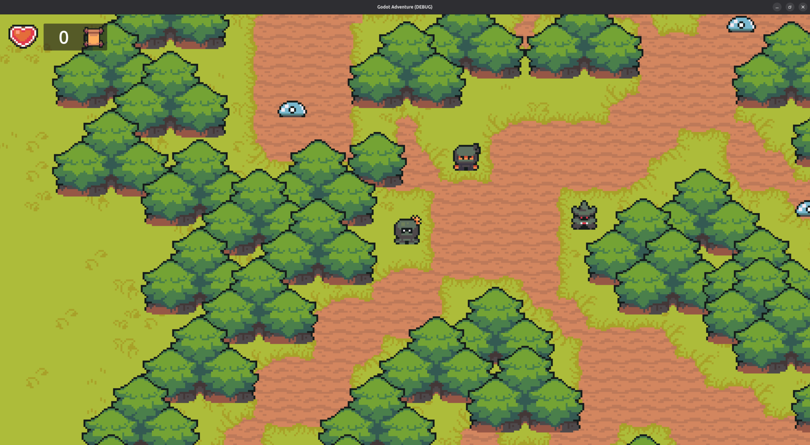

---
categories:
  - Activiteiten
tags:
  - 2D
  - Godot
  - Spel
---

# 2D Top-down Avonturenspel

Tijdens deze activiteit gaan we een 2D, top-down, actie avonturen spel maken. Denk hierbij aan [de originele Zelda spellen](<https://nl.wikipedia.org/wiki/The_Legend_of_Zelda_(computerspel)>) voor de (S)NES, GameBoy, etc.

Voor het maken van het spel gebruiken we [een gratis, open-source, professionele game engine](https://godotengine.org/) waar vrijwel alle soorten spellen in gemaakt kunnen worden.

Hieronder zie je een voorbeeld van het soort spel dat we gaan maken.

_Dit is een erg lange activiteit die plaats vindt over meerdere CoderDojos! Zorg er voor dat je een eigen laptop meeneemt zodat je het spel kunt bewaren en er thuis aan verder kunt werken!_
