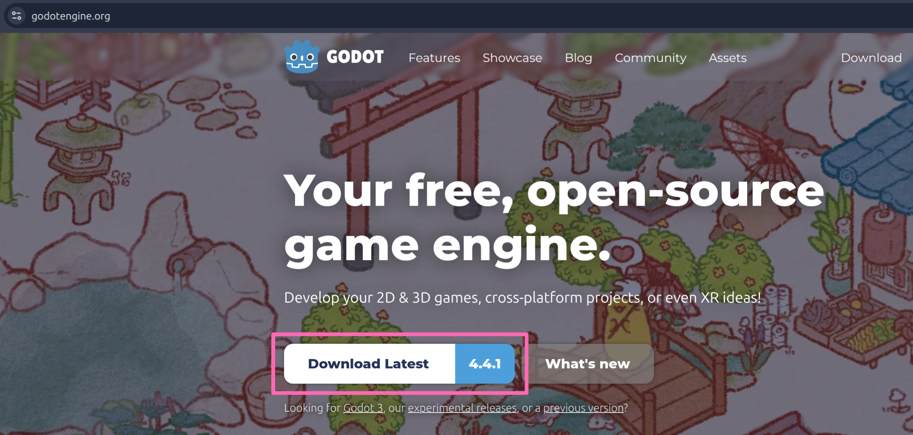
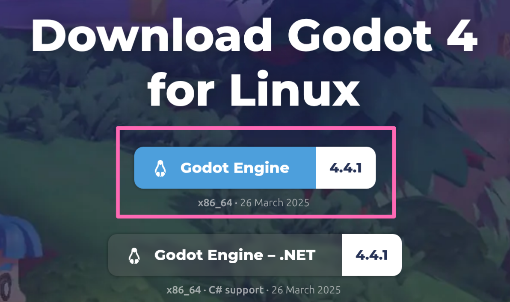
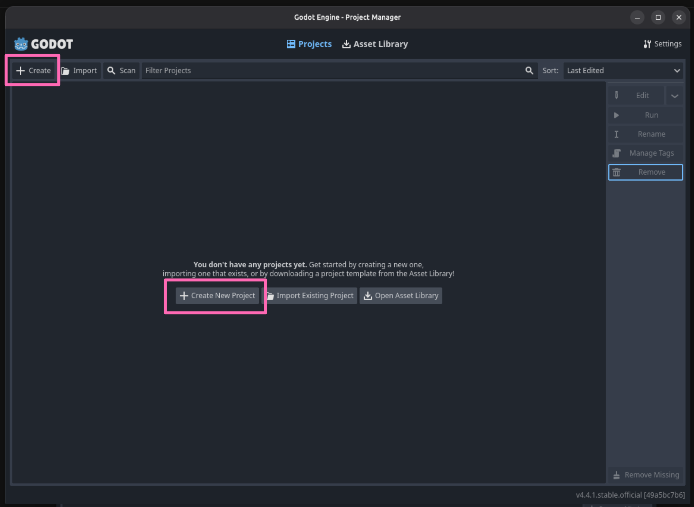
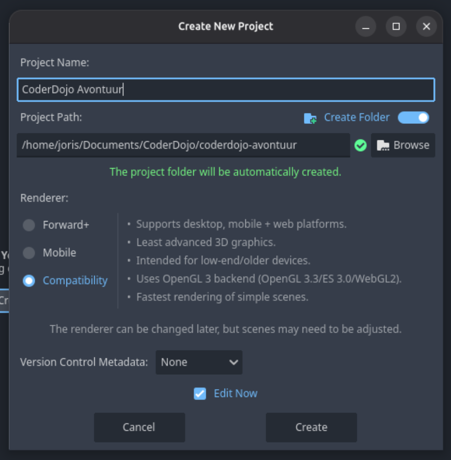
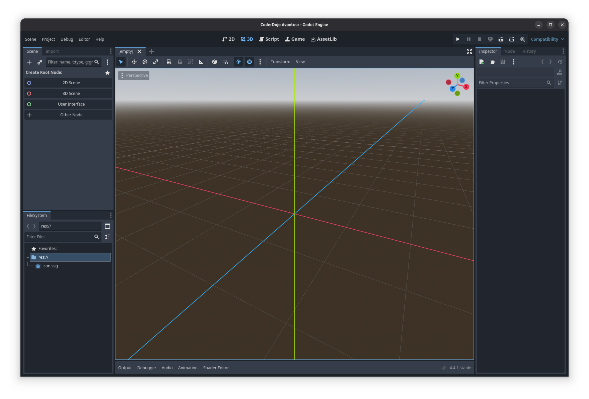
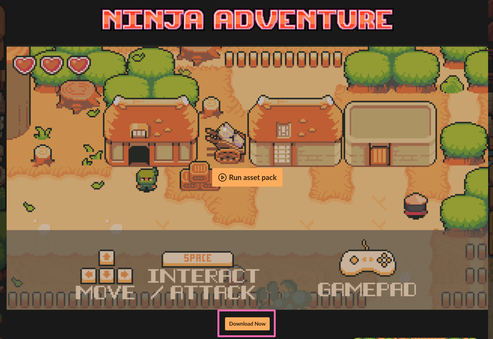
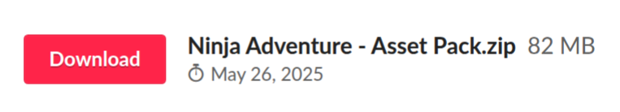
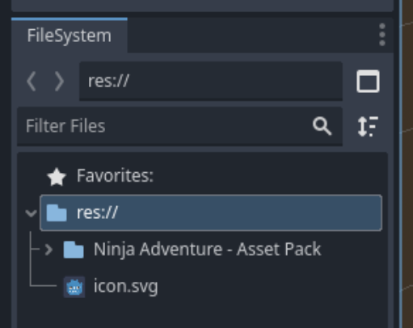

---
categories:
  - Activiteiten
order: 1
tags:
  - 2D
  - Godot
  - Spel
---

# Voorbereiding

Om te beginnen gaan we een aantal benodigdheden downloaden die we nodig hebben om het spel te maken.

Om overzichtelijk te kunnen werken slaan we alles op een overzichtelijke locatie op. Maak een map aan op je computer, bijvoorbeeld in je documenten, en geef de map een herkenbare naam, bijvoorbeeld _CoderDojo_.

## Game Engine

De "game engine" is het programma waarin we het spel gaan maken, we kunnen er onze werelden mee bouwen, gedrag programmeren voor ons spelerskarakter, vriendelijke NPCs, vijanden, schatten, etc.

Misschien heb je wel eens gehoord van programma's als [Unreal Engine](https://www.unrealengine.com/), [Unity](https://unity.com/) of [GameMaker](https://gamemaker.io/). Dit zijn allemaal "game engines". Wij gebruiken [Godot](https://godotengine.org/), een gratis beschikbare, krachtige engine waar je voor verschillende platformen spellen kunt maken. Hoewel wij in deze activiteit zullen focussen op het maken van een 2D spel, kun je met Godot ook 3D spellen maken.

Het installeren van Godot is eenvoudig, we hoeven het alleen te downloaden van [de website](https://godotengine.org), het `.zip` bestand op te slaan in de map die we eerder hebben aangemaakt en uit te pakken.

Wanneer het `.zip`-bestand is uitgepakt houden we een enkel bestand over wat we kunnen openen om de Godot Project Manager te starten.

Klik op de _Create_ of _Create New Project_ knop om een nieuw project te starten.

- Geef je spel een naam onder _Project Name_,
- Klik op _Browse_ en selecteer de map die je eerder hebt aangemaakt, bijvoorbeeld _CoderDojo_ in je documenten,
- Selecteer _Compatibility_,
- Zet _Version Control Metadata_ op _None_,
- Vink _Edit now_ aan,
- Klik op _Create_.

Na een ongenblik wachten verschijnt het hoofdscherm van Godot.

Er is veel te zien op dit scherm, over de komende periode zullen we geleidelijk kennis maken met de verschillende onderdelen. Het 3D scherm wat standaard als eerste opent, zullen we niet gebruiken tijdens deze activiteit.

Voordat we beginnen met het verder verkennen van Godot, maken we eerst nog een kleine uitstap voor het downloaden van wat meer benodigdheden voor ons spel.

## Assets

Hoewel het mogelijk is om een spel volledig te bouwen met behulp van code, is het schrijven van code doorgaans maar een klein onderdeel van het ontwikkelingsproces en worden de meeste spellen vorm gegeven door middel van "assets". Assets zijn de bouwblokken waarmee speler karakters vorm gegeven worden, geanimeerd worden, geluidseffecten, muziek, etc. Het maken van deze assets is doorgaans een tijds-intensief proces. Om ons vooral te kunnen focusen op bouwen van het spel en minder op hoe het er uit ziet en klinkt, maken we voor deze activiteit gebruik van assets die reeds door iemand anders gemaakt zijn en beschikbaar zijn gesteld.

['pixel-boy'](https://pixel-boy.itch.io/) heeft [een mooi asset pack](https://pixel-boy.itch.io/ninja-adventure-asset-pack), met sprites voor speler karakters, monsters, schatten, gebruiksvoorwerpen, wapens, omgevingen, visuele en geluidseffecten, muziek en nog veel meer gemaakt en gratis beschikbaar gesteld. Het thema van het asset pack is _Ninja Adventure_.

- Ga naar de website door op de afbeelding hierboven te klikken,
- Klik op de _Download Now_ knop,
- Klik op _No thanks, just take me to the downloads_.
- Klik op de _Download_ knop bij _Ninja Adventure - Asset Pack.zip_,
  
- Sla het `.zip`-bestand op in de project map die aangemaakt is door Godot (dus de map _in_ de map die je aan het begin met de hand hebt gemaakt, bijvoorbeeld _CoderDojo_ in je documenten),
- Pak het bestand uit.
- Je hebt nu een map genaamd _Ninja Adventure - Asset Pack_ in dezelfde map waar je een `icon.svg` van het Godot logo en een `project.godot` bestand vindt.
- Verwijder het `.zip`-bestand (optioneel).

Kijk alvast rond door deze nieuwe map om te zien wat er zoal beschikbaar is om een spel mee te maken. Kijk vooral alvast in de _Actors / Characters_ map om een goede look te vinden voor je speler.

Als alles goed is gegaan, zie je nu links onderin in Godot in het _Filesystem_ scherm de _Ninja Adventure - Asset Pack_ verschijnen.

!!!
We zijn nu klaar om te beginnen met het bouwen van ons spel!
!!!
